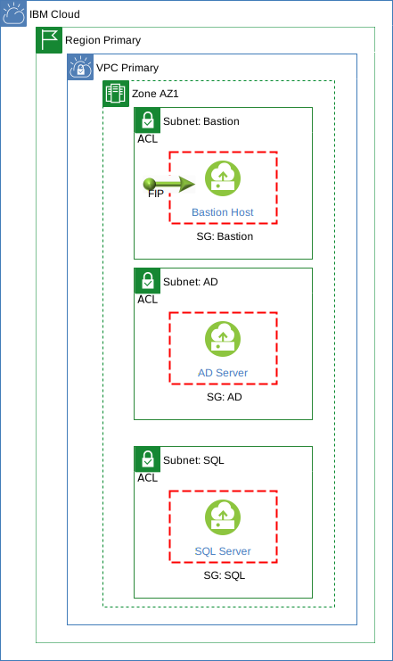

---

copyright:
   years: 2021
lastupdated: "2021-05-26"

keywords:

subcollection: vpc-mssql-howto

content-type: tutorial
services: vpc
account-plan: paid
completion-time: 2h

---
{:shortdesc: .shortdesc}
{:screen: .screen}  
{:codeblock: .codeblock}  
{:pre: .pre}
{:tip: .tip}
{:note: .note}
{:external: target="_blank" .external}
{:step: data-tutorial-type='step'}

# Install Microsoft SQL Server in your Virtual Private Cloud (VPC)
{: #tutorial-mssql-singleaz}
{: toc-content-type="tutorial"}
{: toc-services="vpc"}
{: toc-completion-time="2h"}

<!-- The short description should be a single, concise paragraph that contains one or two sentences and no more than 50 words. Briefly mention what the user's learning goal is and include the following SEO keywords in the title short description: IBM Cloud, ServiceName, tutorial.-->

In this tutorial, you learn how to install Microsoft SQL Server 2019, with a Bring Your Own Licence (BYOL) and a configuration file, in the next generation of the IBM Cloud platform, in your [Virtual Private Cloud](/docs/vpc?topic=vpc-about-vpc). VPC gives you the security of a private cloud environment with the dynamic scalability of a public cloud.
{: shortdesc}

## Objectives
{: ##tutorial-mssql-singleaz-objectives}

* Learn how to configure storage spaces using PowerShell with a VPC virtual server and block storage.
* Install MS SQL Server with BYOL on a VPC Windows 2019 virtual server using a quiet install and a configuration file.



{: figure caption="Figure 1. A diagram that shows the architecture for this tutorial."}

This solution tutorial is based on the pattern, shown in the preceding diagram, and consists of the following:

* VPC - A single VPC.
* Region - A single region.
* Subnets - Three subnets in a single AZ:
  * Bastion - This subnet is used to host a virtual server used for management access.
  * AD - This subnet hosts an Active Directory (AD) server.
  * SQL - This subnet hosts the virtual server that will host SQL Server.
* Security groups - The following three security groups are used:
  * Bastion - This group is used to protect the bastion host.
  * AD - This group is used to protect the AD server.
  * SQL - This group is used to protect the database server.
* Virtual Servers - Three Microsoft Windows 2019 Standard servers:
  * Bastion host - This server allows a central location for access to the environment and a place to host the management tools including SQL Server Management Studio (SMSS). It also hosts an SMB file share so that the database server can access files downloaded from the Internet by the bastion host.
  * AD server - This server hosts the active directory forest/domain.
  * SQL server - This server will run SQL Server and is the focus of this tutorial.
* Floating IP - A single floating IP is associated with the bastion host to allow external access.

## Before you begin
{: ##tutorial-mssql-singleaz-prereqs}

Before you begin this tutorial, you must have the following:

* A VPC in your required region, see [Using the CLI to create VPC resources](/docs/vpc?topic=vpc-creating-a-vpc-using-cli).
* Subnets in the VPC for the virtual servers, see [Create a subnet](docs/vpc?topic=vpc-creating-a-vpc-using-cli#create-a-subnet-cli).
* A public virtual server running Windows 2019 to host SQL server, see [Create an instance](docs/vpc?topic=vpc-creating-a-vpc-using-cli#create-an-instance).
* Three data disks attached to the server that will hist SQL server that will be used for; data, logs and tempdb. See [Create a block storage data volume](/docs/vpc?topic=vpc-creating-a-vpc-using-cli#create-block-storage-data-volume-cli) and [Attach a block storage data volume](https://cloud.ibm.com/docs/vpc?topic=vpc-creating-a-vpc-using-cli#attach-block-storage-data-volume-cli)
* The virtual server and storage specification we used was as follows:
  * **Profile:** mx2d-4x32.
  * **Type:** Public.
  * **OS:** Windows 2019.
  * **NIC Qty:** 1.
  * **Instance Storage:** tempdb: 150GB.
  * **Data Volumes:**
    * sqldb01-data: 1024 GB, Tiered-5IOPS/GB, Provider Managed Encryption.
    * sqldb01-log: 1024 GB, Tiered-5IOPS/GB, Provider Managed Encryption.
* An existing active directory server that has been configured with:
  * A domain.
  * Domain groups and users for the role of SQL Admin and SQL Service.
* An existing bastion host, to allow administrative access via the Internet using Remote Desktop Protocol (RDP). The bastion host has a Floating IP attached.
* The following software has been downloaded to the bastion host:
  * MS SQL Server Developer Edition which can be downloaded from [SQL Server products & resources](https://www.microsoft.com/en-gb/evalcenter/evaluate-sql-server-2019?filetype=EXE){:external}.
  * SQL Server Management Studio (SSMS) which can be downloaded from [Download SQL Server Management Studio (SSMS)](https://docs.microsoft.com/en-us/sql/ssms/download-sql-server-management-studio-ssms?view=sql-server-ver15){:external}.
  * The SQL Server configuration file used in this tutorial should be downloaded from the [tutorial repository](https://github.com/IBM-Cloud/vpc-tutorials/xxxxxxxx). **NEED TO GET ACCESS TO THIS REPOSITORY (https://github.com/IBM-Cloud/vpc-tutorials) AND PLACE THE FILE THERE**
* The files above are in share that is accessible from the virtual server that will host SQL Server.
* SMSS has been installed on the bastion host.
* The MS SQL Server file previously downloaded should be run, which will downloaded additional files and the executable run to extract them make them available in the share.
* Security groups and Access Control Lists (ACL) have been configured to allow access to all the resources and that the required traffic can flow. See [Service overview and network port requirements for Windows](https://docs.microsoft.com/en-us/troubleshoot/windows-server/networking/service-overview-and-network-port-requirements){:external}
* Passwords for the virtual servers. See [Connecting to Windows instances](/docs/vpc?topic=vpc-vsi_is_connecting_windows) to get access to the Windows Administrator's password.
* During this tutorial you will use the following information from the resources in your VPC environment:
  * The IP address of the active directory domain controller: <addns_ip_address>.
  * The Fully Qualified Domain Name (FQDN) of the active directory domain controller: <ad_server_fqdn>.
  * The active directory domain name: <domain>.
  * The password for the domain administrator: <admin_password>.
  * The hostname of the bastion server: <bastion_hostname>.
  * The user name that has access to the share on the bastion host: <smbuser>.
  * The password for the share user: <share_password>.

## Step 1: Join the domain
{: ##tutorial-mssql-singleaz-join}
{: step}

In this step you connect to the bastion host, then connect to the virtual server that will host SQL server and then use PowerShell to join the server to the active directory domain:

* The `Get-DnsClientServerAddress` captures the Interface Index for the IPv4 Ethernet interface, so that the DNS can be changed from the IBM Cloud DNS server to the  your active directory domain controller. The `Add-Computer` command will fail if this step is missed as the server will not be able to locate the domain controller. The `Add-Computer -Server` only accepts Fully Qualified Domain Name (FQDN).
* The `Add-Computer` command adds the server to the domain <domain> using the active directory domain controller <ad_server_fqdn> and then restarts the server to make the change effective.

1. Using RDP connect to the Floating IP address of the bastion host.
1. From the bastion host use RDP to connect to the virtual server that will host SQL Server.
1. Open a PowerShell console session that has administrative access and use the following commands, replacing <addns_ip_address>, <ad_server_fqdn>, <domain> and <admin_password> with your values.

```
$dns = "<addns_ip_address>"
$adserver = "<ad_server_fqdn>"
$domain = "<domain>"
$user = $domain + "\Administrator"
$password = "<password>"
$out=Get-DnsClientServerAddress -InterfaceAlias Ethernet -AddressFamily IPv4 | Select-Object -Property InterfaceIndex
Set-DnsClientServerAddress -InterfaceIndex $out.InterfaceIndex -ServerAddresses ($dns)
$password = ConvertTo-SecureString $password -AsPlainText -Force
$credential = New-Object System.Management.Automation.PSCredential ($user, $password)
Add-Computer -DomainName $domain -Server $adserver -Restart -Credential $credential
```
{: pre}

## Step 2: Connect to the bastion host SMB share
{: ##tutorial-mssql-singleaz-share}
{: step}

In this step we will connect the the share on the bastion host to the server as the Z: drive so that we can access the downloaded software. The following PowerShell commands are used to:

* Check to see the status of the SMB2, typically this protocol is disabled in the virtual server image. If disabled it can be enabled using `Set-SmbServerConfiguration` , as it is required for SMB to operate.
* Connect to the share on <bastion_hostname>\Downloads,as the Z: drive using the user <smbuser> and the password <share_password>

On the virtual server that will host SQL Server and in a PowerShell console session that has administrative access, use the following commands, replacing <bastion_hostname>, <smbuser> and <share_password> with your values.

```
$bastion = "<bastion_hostname>"
$user = "<smbuser>"
$sharepassword = "<share_password>"
$shareuser = $bastion + '\' + $user
$path = '\\' + $bastion + '\' + 'Downloads'
Get-SmbServerConfiguration | Select EnableSMB2Protocol
Set-SmbServerConfiguration -EnableSMB2Protocol $true -Force
New-SmbMapping -LocalPath 'Z:' -RemotePath $path -UserName $shareuser -Password $sharepassword -Persistent $true
```
{: pre}

## Step 3: Collect disk serial numbers storage spaces
{: ##tutorial-mssql-singleaz-serial}
{: step}

In this tutorial we are using Storage Spaces. Storage Spaces is a technology in Windows Server that is conceptually similar to RAID, and is implemented in the operating system. Storage spaces can be used to group data volumes together into a storage pool and then the capacity from the pool is then used to create Storage spaces (virtual disks). A Storage Space appears to the Windows operating system as a regular drive from which you can create formatted volumes. See [Storage Spaces overview](https://docs.microsoft.com/en-us/windows-server/storage/storage-spaces/overview){:external}. In this tutorial, we will be using a single data volume in each pool, however, for performance and capacity reasons you may require more data volumes in each pool, and the use of Storage Spaces makes this an easier task. In this step we collect the serial numbers of the disks which is required for latter steps.


1. From the IBM Cloud console, capture the storage volumes information for data volumes attached to the virtual server that will host SQL Server. For example, the serial number on the IBM Cloud Console will be in the following format. Your serial numbers will be different and you names for the data volumes sqldb01-data and sqldb01-log may be different:

   * **sqldb01-data:** 0787-ff88b86a-1e29-4f0d-8a69-67b4deda3d5c-lpcn2
   * **sqldb01-log:** 0787-1d41b85e-4e8a-499e-b889-13b96db5251c-2w2n2

1. On the virtual server that will host SQL Server and in a PowerShell console session that has administrative access, use the PowerShell command; `Get-StoragePool -IsPrimordial $true | Get-PhysicalDisk -CanPool $True` to capture the Windows OS view of the SerialNumber for use in subsequent PowerShell commands. As can be seen from the following example, the SerialNumbers can be captured and then related to your data and log data volumes:

```
Number FriendlyName       SerialNumber                         MediaType   CanPool OperationalStatus HealthStatus Usage           Size
------ ------------       ------------                         ---------   ------- ----------------- ------------ -----           ----
1      QEMU QEMU HARDDISK cloud-init-0787_1c6e0975-a584-43ca-b Unspecified True    OK                Healthy      Auto-Select   378 KB
5      Red Hat VirtIO     cloud-init-                          Unspecified True    OK                Healthy      Auto-Select    44 KB
3      Red Hat VirtIO     0787-ff88b86a-1e29-4                 Unspecified True    OK                Healthy      Auto-Select     1 TB
4      Red Hat VirtIO     0787-1d41b85e-4e8a-4                 Unspecified True    OK                Healthy      Auto-Select     1 TB
2      Red Hat VirtIO     70ab84c0-0e12-4fc2-a                 Unspecified True    OK                Healthy      Auto-Select 139.7 GB
```

## Step 4: Create the storage pools
{: ##tutorial-mssql-singleaz-pool}
{: step}

In this step we will use a PowerShell command to configure the storage pools. The PowerShell command achieves the following:

* Creates a storage pool.
* Creates a virtual disk in this pool for striping (-ResiliencySettingName simple).
* The virtual disk is initialized with a GPT partition and assigned a drive letter.
* The virtual disk is formatted with the NTFS filesystem with a block size of 64KB and assigned a label.

1. On the virtual server that will host SQL Server and in a PowerShell console session that has administrative access, use the following PowerShell command, replacing <SerialNumber> with the serial number for the sqldb01-data volume.

```
$dataserial = "<SerialNumber>"
New-StoragePool -FriendlyName "sqldatapool" -StorageSubsystemFriendlyName "Windows Storage*" -PhysicalDisks (Get-PhysicalDisk -SerialNumber $dataserial) | New-VirtualDisk -FriendlyName "sqldata" -Interleave 65536 -NumberOfColumns 1 -ResiliencySettingName simple –UseMaximumSize | Initialize-Disk -PartitionStyle GPT -PassThru | New-Partition -DriveLetter "D" -UseMaximumSize | Format-Volume -FileSystem NTFS -NewFileSystemLabel "SQLDATA" -AllocationUnitSize 65536 -Confirm:$false -UseLargeFRS
```
{: pre}

2. To create the sqllogpool use the following PowerShell command, replacing <SerialNumber> with the serial number for the sqldb01-log volume.

```
$logserial = "<SerialNumber>"
New-StoragePool -FriendlyName "sqllogpool" -StorageSubsystemFriendlyName "Windows Storage*" -PhysicalDisks (Get-PhysicalDisk -SerialNumber $logserial) | New-VirtualDisk -FriendlyName "sqllog" -Interleave 65536 -NumberOfColumns 1 -ResiliencySettingName simple –UseMaximumSize | Initialize-Disk -PartitionStyle GPT -PassThru | New-Partition -DriveLetter "E" -UseMaximumSize | Format-Volume -FileSystem NTFS -NewFileSystemLabel "SQLLOG" -AllocationUnitSize 65536 -Confirm:$false -UseLargeFRS
```
{: pre}

## Step 5: Initialize instance storage for tempdb
{: #mssql-sql-configstorage-tempdb}

The drive for tempdb does not use Storage Spaces, as Instance Storage will only provide a single volume. In this step we will use a PowerShell command to configure the following:

* Create a drive initialized with a GPT partition and assigned a drive letter of F.
* The drive is formatted with the NTFS filesystem with a block size of 64KB and assigned a label of TEMPDB.

On the virtual server that will host SQL Server and in a PowerShell console session that has administrative access, use the following PowerShell command, replacing <SerialNumber> with the serial number for the instance storage volume.

```
$tempdbserial = "<SerialNumber>"
Get-Disk | Where SerialNumber -eq $tempdbserial | Initialize-Disk -PartitionStyle GPT -PassThru | New-Partition -DriveLetter "F" -UseMaximumSize | Format-Volume -FileSystem NTFS -NewFileSystemLabel "TEMPDB" -AllocationUnitSize 65536 -Confirm:$false -UseLargeFRS
```
{: pre}

## Step 6: Install SQL Server
{: ##tutorial-mssql-singleaz-install}
{: step}

In the steps so far, we have provided the pre-requisites for the SQL server install and are now ready to run the installer. While there are the following three options, this tutorial focuses on using an existing .ini file:

* Run the installer interactively to install SQL Server.
* Run the installer interactively to capture a ConfigurationFile.ini for a latter installation.
* Use an existing ConfigurationFile.ini, i.e one form this set of documentation and install SQL Server.

1. On the virtual server that will host SQL Server copy the folder from the bastion host share that contains the extracted SQL server install files to a local folder e.g. C:\SQL2019.
1. Copy the ConfigurationFile.ini file from the bastion host share to a local folder.
1. In a PowerShell console session that has administrative access, change directory to the local folder that hosts the installation files and use the following command replacing <svc_password> and <agt_password> with the password for the domain service account configured in the pre-requisites:

```
SETUP.exe /ConfigurationFile=ConfigurationFile.ini /TCPENABLED="1" /SQLSVCPASSWORD="<svc_password>" /AGTSVCPASSWORD="<agt_password>"
```
{: pre}

1. The installer should now run and complete.

## Step 7: Verify TCP/IP
{: ##tutorial-mssql-singleaz-tcpip}
{: step}

In this step we will use the SQL Server Configuration Manager to verify that TCP/IP has been enabled on the server's interface and the loopback address (127.0.0.1)

1. On the SQL server, open the SQL Server Configuration Manager by selecting it from the Start menu.
1. Expand the SQL Server Network Configuration node to view the Protocols for MSSQLSERVER.
1. At the details area, right-click on the TCP/IP protocol and choose Properties.
1. From the TCP/IP Properties window, choose the IP Addresses tab.
1. Look for the interface that has the Server's IPv4 IP address.
1. Verify that Enabled is set to Yes. If set to No, Select Yes.
1. Look for the interface that has the Server's IPv4 loopback address (127.0.0.1).
1. Verify that Enabled is set to Yes. If set to No, Select Yes.
1. Click OK, and OK again.
1. The service will need to be restarted for the changes to be made effective.
1. Select SQL Server Services, and restart the SQL Server service.

## Step 8: Configure the Windows firewall
{: ##tutorial-mssql-singleaz-fw}
{: step}

In this step you will use PowerShell to open TCP port 1433 in the Windows firewall to allow external access to SQL server. On the SQL Server and in a PowerShell console session that has administrative access, use the following PowerShell command:

```
New-NetFirewallRule -DisplayName 'SQL-Inbound' -Profile Domain -Direction Inbound -Action Allow -Protocol TCP -LocalPort 1433
```
{: pre}

## Step 9: Connect to SQL Server
{: ##tutorial-mssql-singleaz-connect}
{: step}

SQL Server has now been installed and the Windows firewall configured to allow inbound connections. To manage the server SQL Server Management Studio (SSMS), installed on the bastion host is used.

1. On the bastion host, use the Start Menu to find SSMS.
2. Right-click on the icon and select More and then select Run as different user.
3. In the dialog box, enter the username and password for a SQL Admin user i.e. sqluser1
4. In the SSMS object explorer, select connect and then Database Engine.
5. In the dialog box enter the server hostname e.g. sqldb01 and press connect.
6. You should now be connected to the SQL server and be able to review the configuration.

If you are unable to connect, see [Troubleshoot connecting to the SQL Server Database Engine](https://docs.microsoft.com/en-us/sql/database-engine/configure-windows/troubleshoot-connecting-to-the-sql-server-database-engine?view=sql-server-ver15){:external} for advice.

## Next steps
{: #tutorial-mssql-singleaz-step-next}
* [Quickstart: Connect and query a SQL Server instance using SQL Server Management Studio (SSMS)](https://docs.microsoft.com/en-us/sql/ssms/quickstarts/ssms-connect-query-sql-server?view=sql-server-ver15){:external}
* [SQL Server technical documentation](https://docs.microsoft.com/en-us/sql/sql-server/?view=sql-server-ver15)
